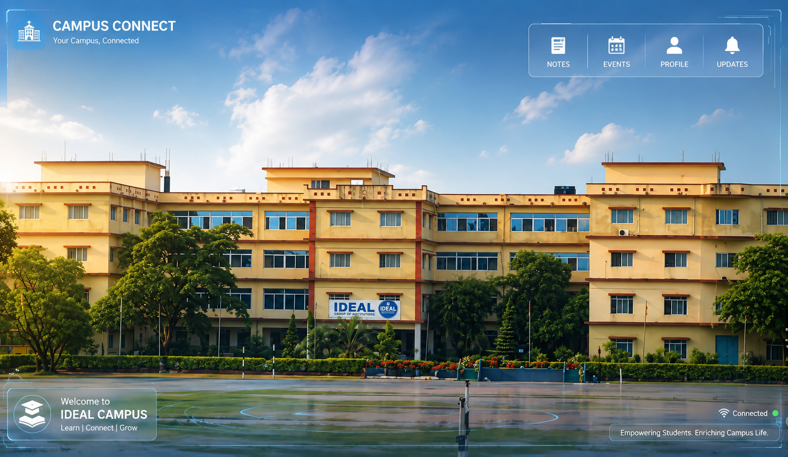

# CampusConnect

> One campus. One connected experience.



CampusConnect is a responsive, multi-page campus portal concept that brings everyday student services into one place: academic progress, campus updates, career preparation, and quick access to student tools.

## Find Your Way Around

| Your day                | Open                                                                          |
| ----------------------- | ----------------------------------------------------------------------------- |
| Start at the campus hub | [Home](index.html) · [Dashboard](dashboard.html) · [Profile](profile.html)    |
| Keep up with coursework | [Attendance](attendance.html) · [Results](results.html) · [Notes](notes.html) |
| See what's happening    | [Events](events.html) · [Bus](bus.html) · [Analytics](analytics.html)         |
| Plan what comes next    | [Placement prep](placement.html) · [Campus assistant](chatbot.html)           |
| Enter the portal        | [Register](register.html) · [Login](login.html)                               |

## Run It Locally

To run the static pages only, clone the repository and open `index.html` in a browser:

```bash
git clone https://github.com/nagasai507/Campus-Connect.git
cd Campus-Connect
```

Or serve the folder locally with Python:

```bash
python -m http.server 8000
```

Then visit [http://localhost:8000](http://localhost:8000). The pages load fonts, icons, and animation assets from CDNs, so an internet connection is needed for those external resources.

## MongoDB Backend

The project includes a Node.js + MongoDB backend for authentication and portal records.

### 1) Install dependencies

```bash
npm install
```

### 2) Start MongoDB locally

If MongoDB is installed locally, start it:

```bash
mongod
```

Copy the example environment file and set `MONGODB_URI` for your database. Keep your real `.env` file private; it is ignored by Git.

```bash
copy .env.example .env
```

Default connection:

```env
PORT=5000
MONGODB_URI=mongodb://127.0.0.1:27017/campusconnect
```

### 3) Run the backend and portal

```bash
npm start
```

The Express server hosts the portal and API at `http://localhost:5000`. The API includes:

- `http://localhost:5000/api/health`
- `GET http://localhost:5000/api/users`
- `POST http://localhost:5000/api/register`
- `POST http://localhost:5000/api/login`
- `GET/PUT/DELETE http://localhost:5000/api/records/:kind`

## Project Map

```text
CampusConnect/
|-- index.html          # Landing page
|-- dashboard.html      # Campus dashboard
|-- attendance.html     # Attendance
|-- results.html        # Results
|-- notes.html          # Notes
|-- events.html         # Events
|-- bus.html            # Bus information
|-- placement.html      # Placement preparation
|-- chatbot.html        # Campus assistant
|-- analytics.html      # Analytics
|-- login.html          # Login screen
|-- register.html       # Registration screen
|-- profile.html        # Student profile
|-- css/                # Page and shared styles
|-- js/                 # Browser-side interactions
`-- images/             # Campus artwork
```

## Built With

HTML, CSS, and browser-side JavaScript, with Google Fonts, Font Awesome, and AOS loaded from their respective CDNs.
